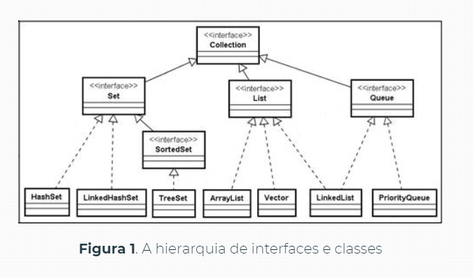
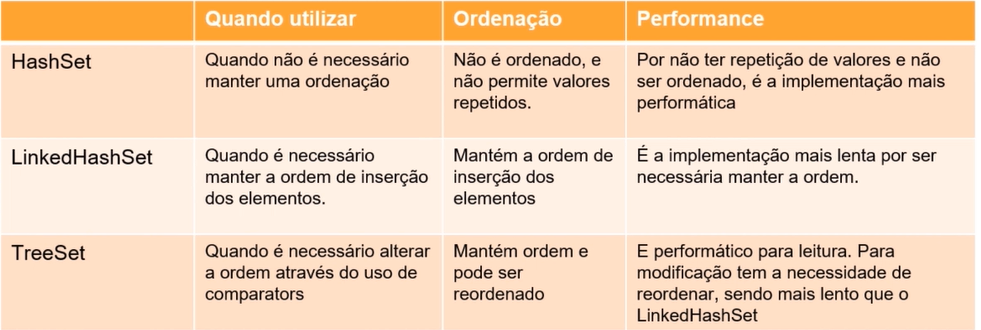
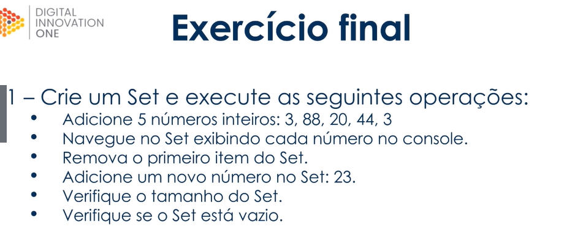

# **_Implementação Collections e Streams com java_**

# **_Collections I- List_**

## **Introdução a Collections**

Collections Framework é um conjunto bem definido de interfaces e classes para representar e tratar grupos de dados como uma única unidade, que pode ser chamada coleção, ou collection. A Collections Framework contém os seguintes elementos:

- Interfaces: tipos abstratos que representam as coleções. Permitem que coleções sejam manipuladas tendo como base o conceito “Programar para interfaces e não para implementações”, desde que o acesso aos objetos se restrinja apenas ao uso de métodos definidos nas interfaces;
- Implementações: são as implementações concretas das interfaces;
- Algoritmos: são os métodos que realizam as operações sobre os objetos das coleções, tais como busca e ordenação.



## **Identificando as interfaces de Collections**

1. Entender o uso da interface java.util.List
2. Entender o uso da interface java.util.Queue
3. Entender o uso da interface java.util.Set
4. Entender o uso da interface java.util.Map

## **O que é List e como trabalhar com ela**
- Implementações que aprenderemos
  - java.util.ArrayList
  - java.util.Vector

- Garante ordem de inserção
- Permite adição, atualização leitura e remoção sem regras adicionais
- Permite ordenação através de `comparators`

### **Exemplo List**:

```java
import java.util.*;

public class ExemploArrayList {
    public static void main(String[] args) {
        List<String> lista = new ArrayList<>();

        lista.add("Poliane");
        lista.add("Anna");
        lista.add("Amanda");
        lista.add("Leticia");
        lista.add("Paula");
        lista.add("Juliana");
        System.out.println("Métodos");
        System.out.println("lista " + lista);
        Collections.sort(lista);//Ordenação simples por texto

        System.out.println("lista.sort() :" + lista);

        lista.set(1,"Ana"); //Método de atulização no index desejado
        System.out.println("lista.set(1,'Ana') " + lista);

        lista.remove(1); //Remoção do elemento 1
        System.out.println("lista.remove(1) " + lista);

        lista.remove("Juliana"); //Remoção do elemento juliana
        System.out.println("lista.remove('juliana') " + lista);

        System.out.println("lista.get(0) " + lista.get(0)); //Retorna o elemnto da lista na posição desejada

        System.out.println("lista.size() " + lista.size());

        System.out.println("lista.contains('Anderson') " + lista.contains("Anderson"));

        System.out.println("lista.isEmpty() " + lista.isEmpty());

        System.out.println("lista.indexOf('Poliane'): " + lista.indexOf("Poliane"));

        lista.clear();//Limpa a lista
        System.out.println("lista.clear()");

        System.out.println();
        System.out.println("Formas de declarar listas");
        List<String > nomes = Arrays.asList("Bruno", "Bruna","Marcos","Morone","Keliye","Jovan");
        List<String> sobrenomes = List.of("Souza","Martin", "Correio", "Coelho", "Pinheiro", "Jordan");
        System.out.println();

        System.out.println("Formas de percorrer uma lista");

        System.out.println("Foreach");
        for(String nome: nomes){
            System.out.println(nome);
        }
        System.out.println();

        System.out.println("For");
        for (int i =0; i < sobrenomes.size(); i++){
            System.out.println(sobrenomes.get(i));
        }
        System.out.println();

        System.out.println("Interator");
        Iterator<String> iterator =  nomes.iterator();
        while(iterator.hasNext()){ //retorna true se houver obj
            System.out.println(iterator.next()); //Retorna o objeto da interacao
        }
        
    }
}
```
### **Exemplo Vector**

```java
import java.util.List;
import java.util.Vector;

public class ExemploVector {
    public static void main(String[] args) {
        List<String> esportes = new Vector<>();

        //Adicona 5 esportes no vector
        esportes.add("Futebol");
        esportes.add("Tênis de mesa");
        esportes.add("Ping pong");
        esportes.add("Basquetebol");
        esportes.add("Handebol");

        //Altera o valor da posição 2 do vector
        esportes.set(3,"Voleibol");

        //Remove o esporte da posição 4
        esportes.remove(4);
        esportes.remove("Tênis de mesa");

        //Retorna elemento do primeiro index
        System.out.println(esportes.get(0));
        System.out.println();

        //Navegando pelos esportes
        for(String esporte: esportes){
            System.out.println(esporte);
        }
    }
}
```
### **Exercício final**


```java

import java.util.ArrayList;
import java.util.Arrays;
import java.util.List;
import java.util.stream.Collectors;

public class Programa {
    public static void main(String[] args) {
        //List<String> nomes = Arrays.asList("Oi","Tudo");
        //List<String> nomes = List.Set("Nomes");
        List<String> nomes = new ArrayList<>();

        //Adicionando 5 nomes:
        nomes.add("Juliana");
        nomes.add("Pedro");
        nomes.add("Carlos");
        nomes.add("Larissa");
        nomes.add("João");

        //Exibir nomes no console
        nomes.stream().forEach(nome -> System.out.println(nome + " "));

        //Susbstituir o nome de carlos por Robert
        alterarNome(nomes,"Carlos","Roberto");

        //Retorna o nome da posição 1
        System.out.println(nomes.get(1));

        //Remover o nome da posição 4
        nomes.remove(4);

        //Remover o nome João
        nomes.remove("João");

        //Quantidade de itens na lista
        System.out.println(nomes.size());

        //Juliano esta na lista?
        System.out.println(nomes.contains("Juliano"));

        //Nova  lista
        List<String> nomesNovos = new ArrayList<>();

        nomesNovos = nomes.stream().collect(Collectors.toList());
        nomesNovos.add("Ismael");
        nomesNovos.add("Rodrigo");

        //Verificar se tá vázia
        System.out.println(nomes.isEmpty());

        System.out.println(nomes);
        System.out.println();
        System.out.println(nomesNovos);


    }

    public static void alterarNome(List<String> nomes, final String nome, final String novoNome){
        for(int i = 0; i < nomes.size(); i++){
            if(nomes.get(i).equals(nome)){
                nomes.set(i,novoNome);
            }
        }
    }

}
```

# **_Collections II - Queue_**
## **O que é Queue?**
- Implementações que aprenderemos
  - java.util.LikedList
- Garante ordem de inserção
- Permite adição, leitura e remoção considertando a regra básica de uma fila: FIFO;
- Não permite mudança de ordenação.

```java
import java.util.Iterator;
import java.util.LinkedList;
import java.util.NoSuchElementException;
import java.util.Queue;

public class ExemploQueue {
    public static void main(String[] args) {
        Queue<String> fila = new LinkedList<>();
        fila.add("Patricia");
        fila.add("Roberto");
        fila.add("Flávio");
        fila.add("Pamela");
        fila.add("Anderson");

        System.out.println(fila);
        //FIFO

        //mostra e remove o first element in struct
        String clienteASerAtendido = fila.poll();
        System.out.println(clienteASerAtendido);
        System.out.println(fila);

        //fila.clear();

        //Retorna o primeiro elemento e não remove, se tiver vazio retorna null
        String primeiroCliente = fila.peek();
        System.out.println(primeiroCliente);
        System.out.println(fila);


        //retorna o primeiro elemento e não remove e retorna exception
        try{
            String primeiroClienteOuErro = fila.element();
            System.out.println(primeiroClienteOuErro);
            System.out.println(fila);
        }catch (NoSuchElementException e){
            System.out.println("Lista vazia");
            //e.printStackTrace();
        }

        Iterator<String> iterator = fila.iterator();
        while(iterator.hasNext()){
            System.out.println(iterator.next());
        }
    }
}

```
### **Exercício final**


```java
import java.util.Iterator;
import java.util.LinkedList;
import java.util.Queue;

public class Programa {
    public static void main(String[] args) {
        Queue<String> nomes = new LinkedList<>();
        //1
        nomes.add("Julia");
        nomes.add("Pedro");
        nomes.add("Carlos");
        nomes.add("Larissa");
        nomes.add("João");

        //2
        Iterator<String> iterator = nomes.iterator();

        while (iterator.hasNext()){
            System.out.println(iterator.next());
        }
        System.out.println();
        //3
        System.out.println(nomes.peek());
        System.out.println(nomes);
        //4
        System.out.println(nomes.poll());
        System.out.println(nomes);
        System.out.println();
        //5
        nomes.add("Daniel");
        System.out.println(nomes);
        iterator = nomes.iterator();
        int count = 0;
        while(iterator.hasNext()){
            if (iterator.next() == "Daniel"){
                System.out.println(count);
            }
            count++;
        }
        //6
        System.out.println(nomes.size());
        //7
        System.out.println(nomes.isEmpty());
        System.out.println(nomes.contains("Carlos"));
    }
}
```

# **_Collections III- Set_**
## **Aprenda sobre as implementações de Set**
- Implementações que aprenderemos
  - java.util.HashSet
  - java.util.TreeSet 
  - java.util.LinkedHashSet

- Por padrão, não garante ordem
- Não permite itens repetidos
- Permite adição e remoção normalmente. Não possui buscar por item e atualização. Para leitura, apenas navegação;
- Não permite mudança de ordem.




## **Conheça a implementação mais usada em produção: HashSet**

```java
import java.util.HashSet;
import java.util.Iterator;
import java.util.Set;

public class ExemploHashSet {
    public static void main(String[] args) {
        Set<Double> notasAlunos = new HashSet<>();

        //Adiciona as notas no set
        notasAlunos.add(9.0);
        notasAlunos.add(8.0);
        notasAlunos.add(4.0);
        notasAlunos.add(3.0);
        notasAlunos.add(6.0);
        notasAlunos.add(7.0);
        notasAlunos.add(1.0);

        System.out.println(notasAlunos);

        //remove
        notasAlunos.remove(1.0);

        System.out.println(notasAlunos);

        //quantidade intes
        System.out.println(notasAlunos.size());

        //Navegando em todos os itens do iterator
        Iterator<Double> iterator = notasAlunos.iterator();
        while (iterator.hasNext()){
            System.out.println(iterator.next());
        }
        System.out.println();
        for(Double nota : notasAlunos){
            System.out.println(nota);
        }
        System.out.println();

        //Limpa
        notasAlunos.clear();
        //Retorna se o set está vazio
        System.out.println(notasAlunos.isEmpty());

    }
}
```

## **Aprenda na prática sobre LinkedHashSet**

```java
import java.util.Iterator;
import java.util.LinkedHashSet;

public class ExemploLinkedHashSet {
    public static void main(String[] args) {
        LinkedHashSet<Integer> sequenciaNumerica= new LinkedHashSet<>();

        //Adicionando os números no LHS
        sequenciaNumerica.add(1);
        sequenciaNumerica.add(2);
        sequenciaNumerica.add(4);
        sequenciaNumerica.add(5);
        sequenciaNumerica.add(6);
        sequenciaNumerica.add(7);
        sequenciaNumerica.add(8);
        sequenciaNumerica.add(9);
        sequenciaNumerica.add(9);

        System.out.println(sequenciaNumerica);

        //Remove o número do set
        sequenciaNumerica.remove(9);

        //Retorna a quantidade de elementos
        System.out.println(sequenciaNumerica.size());
        System.out.println();

        //Navega em todos os itens do iterator
        Iterator<Integer> iterator = sequenciaNumerica.iterator();
        while (iterator.hasNext()){
            System.out.println(iterator.next());
        }
        System.out.println();
        for(Integer numero: sequenciaNumerica){
            System.out.println(numero);
        }
        System.out.println();

        //Retorna se o set está vazio ou não
        System.out.println(sequenciaNumerica.isEmpty());

    }
}

```
## **Veja sobre árvore binária e TreeSet**
```java
import java.util.Iterator;
import java.util.TreeSet;

public class ExemploTreeSet {
    public static void main(String[] args) {
        TreeSet<String> treeCapitais = new TreeSet<>();

        treeCapitais.add("Belo Horizonte");
        treeCapitais.add("Porto Alegre");
        treeCapitais.add("Florianópolis");
        treeCapitais.add("Curitiba");
        treeCapitais.add("São Paulo");
        treeCapitais.add("Rio de janeiro");

        System.out.println(treeCapitais);

        //Retorna a primeira capital no topo da árvore
        System.out.println(treeCapitais.first());

        //Retorna a última capital no final da árvore
        System.out.println(treeCapitais.last());

        //Retorna a primeira capital avaixo na árvore da capiral parametrizada
        System.out.println(treeCapitais.lower("São Paulo"));

        //Retorna a primeir capital acina na árvore da capital parametrizada
        System.out.println(treeCapitais.higher("São Paulo"));

        //Exibe todas as capitais no console
        System.out.println(treeCapitais);

        //Primeira retorna e removida do set
        System.out.println(treeCapitais.pollFirst());

        //Ultima retornana e remove do set
        System.out.println(treeCapitais.pollLast());

        //Exibe todas as capitais
        System.out.println(treeCapitais);

        Iterator<String> iterator = treeCapitais.iterator();

        while(iterator.hasNext()){
            System.out.println(iterator.next());
        }
    }
```
## **Exercicio final**



```java
import java.util.*;

public class Programa {
    public static void main(String[] args) {
        Set<Integer> lista = new HashSet<>();
        //1
        lista.add(3);
        lista.add(88);
        lista.add(44);
        lista.add(3);

        System.out.println(lista);
        //2
        Iterator<Integer> iterator = lista.iterator();
        while(iterator.hasNext()){
            System.out.println(iterator.next());
        }
        System.out.println();
        //3
        lista.remove(3);
        System.out.println(lista);
        System.out.println();
        //4
        lista.add(23);
        System.out.println(lista);
        System.out.println();
        //5
        System.out.println(lista.size());
        //6
        System.out.println(lista.isEmpty());


    }
}
```

# **_Collections IV - Map_**
## **Aprenda fquando utilizar Map**
- Implementação que aprenderemos
  - java.util.HashMap
  - java.util.TreeMap
  - java.util.HashTable

- Entrada de chave e valor

- Permite valores repetidos, mas não permite repetição de chave.
- Permite adição, busca por chave ou valor, atualização, remoção e novagação.
- Pode ser ordenado

```java
import java.util.HashMap;
import java.util.Map;

public class ExemploHashMap {
    public static void main(String[] args) {
        Map<String, Integer> campeoesMundialFifa = new HashMap<>();
        //Adiciona os campeões mundiais fifa no mapa
        campeoesMundialFifa.put("Brasil",5);
        campeoesMundialFifa.put("Alemanha",4);
        campeoesMundialFifa.put("Itália",4);
        campeoesMundialFifa.put("Uruguai",5);
        campeoesMundialFifa.put("Argentina",5);
        campeoesMundialFifa.put("França",2);
        campeoesMundialFifa.put("Inglaterra",1);
        campeoesMundialFifa.put("Espanha",1);

        System.out.println(campeoesMundialFifa);
        //Atualiza o valor para a chave Brasil
        campeoesMundialFifa.put("Brasil",6);
        System.out.println(campeoesMundialFifa);
        System.out.println();

        //Retorna a argentina
        System.out.println(campeoesMundialFifa.get("Argentina"));
        System.out.println();

        //Retorna se existe ou não um campeão França
        System.out.println(campeoesMundialFifa.containsKey("França"));

        //Remove o campeão frança
        campeoesMundialFifa.remove("França");
        System.out.println(campeoesMundialFifa);

        //Retorna se tem o valor 6
        System.out.println(campeoesMundialFifa.containsValue(6));

        //Retorna o tamanho
        System.out.println(campeoesMundialFifa.size());

        //Navega pelos registros

        for (Map.Entry<String,Integer> entry: campeoesMundialFifa.entrySet()){
            System.out.println(entry.getKey() + " " + entry.getValue());
        }
        System.out.println();
        for(String key: campeoesMundialFifa.keySet()){
            System.out.println(key + " " + campeoesMundialFifa.get(key));
        }
    }
}
```

```java
import java.util.Iterator;
import java.util.Map;
import java.util.TreeMap;

public class ExemploHashTreeMap {
    public static void main(String[] args) {
        TreeMap<String,String> treeCapitais = new TreeMap<>();

        treeCapitais.put("MG","Belo Horizonte");
        treeCapitais.put("RS","Porto Alegre");
        treeCapitais.put("SC","Florianópolis");
        treeCapitais.put("PR","Curitiba");
        treeCapitais.put("SP","São Paulo");
        treeCapitais.put("RJ","Rio de janeiro");

        System.out.println(treeCapitais);

        //Retorna a primeira capital no topo da árvore
        System.out.println(treeCapitais.firstKey());

        //Retorna a última capital no final da árvore
        System.out.println(treeCapitais.lastKey());

        //Retorna a primeira capital avaixo na árvore da capiral parametrizada
        System.out.println(treeCapitais.lowerKey("PR"));

        //Retorna a primeir capital acina na árvore da capital parametrizada
        System.out.println(treeCapitais.higherKey("SP"));

        //Exibe todas as capitais no console
        System.out.println(treeCapitais);


        Map.Entry<String , String> firstEntry = treeCapitais.pollFirstEntry();

        Map.Entry<String , String> lastEntry =  treeCapitais.pollLastEntry();

        //Retorna a primeira capital no topo da árvore removendo do map
        System.out.println(firstEntry.getKey() + " " + firstEntry.getValue());

        //Reetorna a primeira capital no final da árvore removendo do map
        System.out.println(lastEntry.getKey() + " " + lastEntry.getValue());

        //Exibe todas as capitais
        System.out.println(treeCapitais);

        // Navega no map
        Iterator<String> iterator = treeCapitais.keySet().iterator();

        while(iterator.hasNext()){
            System.out.println(iterator.next() + " " + treeCapitais.get(iterator.next().toString()));
        }
        System.out.println();

        for(String capital : treeCapitais.keySet()){
            System.out.println(capital + " " + treeCapitais.get(capital));
        }
        System.out.println();

        for (Map.Entry<String, String> capital: treeCapitais.entrySet()){
            System.out.println(capital.getKey() + " " + capital.getValue());
        }


    }
}

```

```java
import java.util.Hashtable;
import java.util.Map;

public class ExemploHashTable {
    public static void main(String[] args) {
        Hashtable<String,Integer> estudantes = new Hashtable<>();

        estudantes.put("Carlos", 23);
        estudantes.put("Mariana", 33);
        estudantes.put("Rafael", 18);
        estudantes.put("Pedro", 44);
        System.out.println(estudantes);

        estudantes.put("Pedro",55);
        System.out.println(estudantes);

        //Recupera um estudante do indice 2
        int idadeEstudante = estudantes.get("Mariana");
        System.out.println(idadeEstudante);

        System.out.println(estudantes.size());

        //Navega nos registros do mapa
        for(Map.Entry<String, Integer> entry: estudantes.entrySet()){
            System.out.println(entry.getKey() + " " + entry.getValue());
        }
        //Navega nos registros do mapa
        for (String key: estudantes.keySet()){
            System.out.println(key + " " + estudantes.get(key));
        }
    }
}
```
## **Exercício final**

```java
public class Programa {
    public static void main(String[] args) {
        MapWithHashMap map = new MapWithHashMap();
        //adicionando estados
        map.adicionarCidade("Acre", "SC");
        map.adicionarCidade("Alagoas", "AL");
        map.adicionarCidade("Amapá", "AP");
        map.adicionarCidade("Amazonas", "AM");
        map.adicionarCidade("Bahia", "BA");
        map.adicionarCidade("Ceará", "CE");
        map.adicionarCidade("Espírito", "ES");
        map.adicionarCidade("Goiás", "GO");
        map.adicionarCidade("Maranhão", "MA");
        map.adicionarCidade("Mato Grosso", "MT");
        map.adicionarCidade("Mato Grosso do Sul", "MS");
        map.adicionarCidade("Minas Gerais", "MG");
        map.adicionarCidade("Pará", "PA");
        map.adicionarCidade("Paraíba", "PB");
        map.adicionarCidade("Paraná", "PR");
        map.adicionarCidade("Pernambuco", "PE");
        map.adicionarCidade("Piauí", "PI");
        map.adicionarCidade("Rio de Janeiro", "RJ");
        map.adicionarCidade("Rio Grande do Norte", "RN");
        map.adicionarCidade("Rio Grando do Sul", "RS");
        map.adicionarCidade("Rondônia", "RO");
        map.adicionarCidade("Roraima", "RR");
        map.adicionarCidade("Santa Catarina", "SC");
        map.adicionarCidade("São Paulo", "SP");
        map.adicionarCidade("Sergipe", "SE");
        map.adicionarCidade("Tocantins", "TO");

        //2
        System.out.println("REMOVE KEY: " + map.removeKey("Minas Gerais"));
        //3
        map.adicionarCidade("Distrito Federal", "DF");
        //3
        System.out.println("TAMANHO: " + map.tamnho());
        //4
        System.out.println("REMOVE KEY: " + map.removeKey("Mato Grosso do Sul"));
        //5
        map.exibeSigla();
        //6
        System.out.println("Verifica valor: " + map.verificaValor("SC"));
        //7
        System.out.println("Verifica key: "+  map.verificaKey("Maranhão"));

    }
}


mport java.util.HashMap;
import java.util.Map;

public class MapWithHashMap {
    //<key, valor>
    //<cidade, estado>
    private Map<String,String> cidades;

    MapWithHashMap(){
        cidades = new HashMap<>();
    }

    public void adicionarCidade(final String key, final String valor){
        cidades.put(key,valor);
    }

    public boolean removeKey(final String key){
        if(cidades.containsKey(key)){
            cidades.remove(key);
            return true;
        }else{
            return false;
        }

    }

    public boolean removeValor(final String valor){
        for (String key: cidades.keySet()){
            if(cidades.get(key) == valor){
                cidades.remove(key);
                return true;
            }
        }
        return false;

    }

    public int tamnho(){
        return cidades.size();
    }

    public void exibeSigla(){
        for (Map.Entry<String,String> entry: cidades.entrySet()){
            System.out.println(entry.getValue());
        }
    }
    public boolean verificaKey(final String key){
        if(cidades.containsKey(key)){
            return true;
        }else{
            return false;
        }
    }
    public boolean verificaValor(final String valor){
        for(String key: cidades.keySet()){
            if(cidades.get(key) == valor){
                return true;
            }
        }
        return false;
    }
}

```
# **_Collections V - Comparators_**
## **Aprenda a trabalhar com a interface Comparators**
- Interfaces que aprenderemos
  - java.util.Comparator - Interface para definir classe com regra de ordenação
  - java.util.Comparable - Interface para definir regra de ordenação em uma classe de domínio
  
- Algoritmo de ordenação
- Utilizando primariamente em java.util.List
- Permite a ordenação de objetos complexos(criados pelo usuário)

```java
import org.jetbrains.annotations.NotNull;

public class Estudante implements Comparable<Estudante>{
    private final String nome;
    private final Integer idade;

    public Estudante(String nome, Integer idade) {
        this.nome = nome;
        this.idade = idade;
    }
    public String getNome(){return nome;}
    public  Integer getIdade(){return idade;}

    @Override
    public String toString(){ return nome+  " " + idade; }

    @Override //ComparaTo retorna um inteiro 0 igusl -1 ou 1
    public int compareTo(@NotNull Estudante estudante) {
        return this.getIdade() - estudante.getIdade();
    }
}

//

import java.util.ArrayList;
import java.util.Collections;
import java.util.Comparator;
import java.util.List;

public class ComparatorsExempleList {
    public static void main(String[] args) {
        List<Estudante> estudantes = new ArrayList<>();
        estudantes.add(new Estudante("Poliane",23));
        estudantes.add(new Estudante("Leandro",17));
        estudantes.add(new Estudante("Marcos",30));
        estudantes.add(new Estudante("Marcos",24));
        estudantes.add(new Estudante("Raniery",23));
        estudantes.add(new Estudante("Nayara",22));
        estudantes.add(new Estudante("Amanda",22));
        estudantes.add(new Estudante("Sabrina",21));
        estudantes.add(new Estudante("Thiago",19));

        System.out.println("Ordem da inserção");
        System.out.println(estudantes);

        estudantes.sort((first,second)->first.getIdade() - second.getIdade());
        System.out.println("Ordem natural dos números - idade");
        System.out.println(estudantes);

        estudantes.sort((first,second) -> second.getIdade() - first.getIdade());
        System.out.println("Ordem reversa do números - idade");
        System.out.println(estudantes);

        estudantes.sort(Comparator.comparingInt(Estudante::getIdade));

        System.out.println("Ordem natural dos números - method reference");
        System.out.println(estudantes);

        estudantes.sort(Comparator.comparingInt(Estudante::getIdade).reversed());
        System.out.println("Ordem reversa dos números - method reference");
        System.out.println(estudantes);


        Collections.sort(estudantes);
        System.out.println("Interface Comparable");
        System.out.println(estudantes);

        Collections.sort(estudantes,new EstudanteOrdemIdadeReversaComparator());
        System.out.println("Interface Comparator");
        System.out.println(estudantes);
    }
}
//
import java.util.Comparator;

public class EstudanteOrdemIdadeReversaComparator implements Comparator<Estudante> {
    @Override
    public int compare(Estudante t1, Estudante t2) {
        return t2.getIdade() - t1.getIdade();
    }
}


```
## **Exercício final**


```java
//fazer depois
```
# **_Uilizando o Optional_**
## **Aprenda a criar um Optional**

- Tratamento para valores que podem ser nulos
- Possui 2 estados
  - Presente
  - Vazio
- Permite que você execute operações em valores que podem ser nulos sem preocupação com as famosas `NullPointerExceptions`

```java
package optinonal;


import java.util.Optional;

public class ExemploOptionalEstados {
    public static void main(String[] args) {
        Optional<String> stringOptional = Optional.of("Valor presente");

        System.out.println("Valor opcional que está presente");
        stringOptional.ifPresentOrElse(System.out::println,()->System.out.println("não está presente"));


        Optional<String> optionalNull = Optional.ofNullable(null);

        System.out.println("Valor opcional que não está presente");
        optionalNull.ifPresentOrElse(System.out::println,()->System.out.println("null=não está presente"));


        Optional<String> emptyOptional= Optional.empty();
        System.out.println("Valor opcional que não está presente");
        emptyOptional.ifPresentOrElse(System.out::println,()->System.out.println("empty=não está presente"));


        Optional<String> optionalNullErro = Optional.ofNullable(null);

        System.out.println("Valor opcional que lança erro NullPointerException");
        optionalNullErro.ifPresentOrElse(System.out::println,()->System.out.println("erro= não está presente"));

    }
}
///

package optinonal;

import java.util.OptionalDouble;
import java.util.OptionalInt;
import java.util.OptionalLong;

public class ExemploOptionalPrimitivos {
    public static void main(String[] args) {
        System.out.println("Valor inteiro Opcional");
        OptionalInt.of(12).isPresent();

        System.out.println("Valor Decimal opcional");
        OptionalDouble.of(55).isPresent();

        System.out.println("Valor long opcional");
        OptionalLong.of(55).isPresent();
    }
}
///
package optinonal;

import java.util.Optional;

public class ExemploOptional {
    public static void main(String[] args) {
        Optional<String> optionalString = Optional.of("VALOR OPCIONAL");
        System.out.println(optionalString.isPresent());

        //optionalString.isPresent(System.out::println);

        //optionalString.isPresent(System.out::println,()->System.out.println("VALOR NÃO ESTÁ PRESENTE"));

        if (optionalString.isPresent()){
            String valor = optionalString.get();
            System.out.println(valor);
        }

        //optionalString.map(valot->valot.concat("**")).isPresent(System.out::println);
        optionalString.orElseThrow(IllegalStateException::new);
    }
}

```


```java
//Estudar novamente

```

# **_Streams - Dominando fluco de dados_**

## **Streams - Dominando fluxos de dados**

- Manipulação de coleções com o paradgima funcional de forma paralela
- Imutável - não altera a coleção origem,, sempre cria uma nova coelção
- Principais funcionalidades
  - Mappling - retorna uma coleção com mesmo tamanho da origem com os elementos alterados
  - Filtering - retorna uma coleção igual ou menor que a coleção origem, com os elemento s intactos
  - ForEach - executa uma determinada lógiva para cada elemento. retorna nada.
  - Peek - executa uma determinada lógica cada elemento, retornando a própria coleção.]
  - Counting - retorna um inteiro fque representa a contagem de elementos.
  - Groping - retorna uma coleção agrupada de acordo com a regra definida.


```java
import java.util.ArrayList;
import java.util.Comparator;
import java.util.List;
import java.util.stream.Collectors;

public class ExemploStreamAPI {
    public static void main(String[] args) {
        List<String> estudantes = new ArrayList<>();
        estudantes.add("Poliane");
        estudantes.add("Leandro");
        estudantes.add("Marcos");
        estudantes.add("Marcos");
        estudantes.add("Raniery");
        estudantes.add("Nayara");
        estudantes.add("Amanda");
        estudantes.add("Sabrina");
        estudantes.add("Thiago");

        //Retorna a contagem de elementos do sistema
        System.out.println("contagem: " + estudantes.stream().count());

        //Retorna o elemento com maior numero de letras
        System.out.println("Maior numero de letras: " + estudantes.stream().max(Comparator.comparingInt(String::length)));

        //Retorna o elemento com menor numero de letras
        System.out.println("Menor numero de letras: " + estudantes.stream().min(Comparator.comparingInt(String::length)));

        //Retorna os elementos que tem a letra R no nome
        System.out.println("Com letra r no nome: " + estudantes.stream().filter(estudante ->
                estudante.toLowerCase().contains("r")).collect(Collectors.toList()));

        //Retorna uma nova coleção, com os nomes concatenados a quantidade de letra de cada nome
        System.out.println("Retorna uma nova coleçao com a quantidade de letras: " + estudantes.stream().map(estudante ->
                estudante.concat(" - ").concat(String.valueOf(estudante.length()))).collect(Collectors.toList()));

        //Retorna somente os 3 primeiros elementos da coleção
        System.out.println("Retorna os 3 primeiros elementos: " + estudantes.stream().limit(3).collect(Collectors.toList()));

        //Exibe cada elemento no console, e depois retorna a mesma coleção
        System.out.println("Retorna os elementos: " + estudantes.stream().peek(System.out::println).collect(Collectors.toList()));

        //Exibe cada elemento no console sem retorna outra coleção
        System.out.println("Retorna os elementos novamente: ");
        estudantes.stream().forEach(System.out::println);

        //Retorna true se todos os elementos possuem a letra W no nome
        System.out.println("Tem algum elemento com w no nome? " + estudantes.stream().allMatch(elemento -> elemento.contains("w")));

        //Retorna true se algum dos elementos possuem a letra a minúsculo no nome
        System.out.println("Tem algum elemento com a minúsculo no nome? " + estudantes.stream().anyMatch(elemento -> elemento.contains("a")));

        //Retorna true se nenhum elemento possuir a letra a minúsculo no nome
        System.out.println("Nenhum elementos apresenta a lentra a minúsculo no nome? " + estudantes.stream().noneMatch(elemeto -> elemeto.contains("a")));

        //Retorna o primeiro elemento da coleção, se existir exibe a coleção
        System.out.println("Retorna o primeiro elemento da coleção: " + estudantes.stream().findFirst().isPresent());

        //Exemplo de operaç~çao encadeada
        System.out.println("Operação encadeada");
        System.out.println(
                estudantes.stream()
                        .peek(System.out::println)
                        .map(estudante -> estudante.concat(" - ").concat(String.valueOf(estudante.length())))
                        .peek(System.out::println)
                        .filter(estudante -> estudante.toLowerCase().contains("r"))
                        //.collect(Collectors.toList()));
                        //.collect(Collectors.joining(" ,")));
                        //.collect(Collectors.toSet()));
                        .collect(Collectors.groupingBy(estudante -> estudante.substring(estudante.indexOf("4") + 1))));
    }
}
```

## **Exercício final**


 